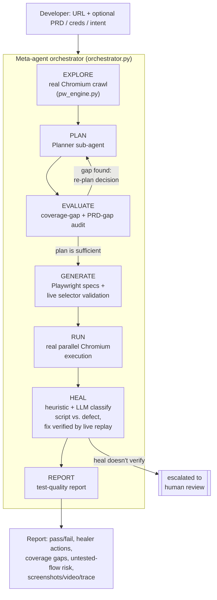

# QAlchemist — Autonomous Test Orchestration Agent

*Turn a URL into proven, self-healing tests. Built by team **Alchemists** for the Bessemer Tech
Catalyst — an agent that transmutes an untested app into a working test suite and a quality report,
end to end, with no manual scripting in between.*

Paste a target web-app URL (+ optional login creds, PRD, or natural-language intent) and an autonomous
meta-agent explores it with a real headless browser, plans meaningful test flows, audits coverage gaps,
generates Playwright specs with live selector validation, runs them for real, self-heals broken scripts
(verified by replaying the fix in a live browser, not assumed) vs. classifies genuine app defects —
streaming every decision live and producing an exportable test-quality report.

**Pipeline (state machine):** `EXPLORE → PLAN → EVALUATE → GENERATE → RUN → HEAL → REPORT`

The meta-agent is not a fixed one-pass pipeline: if the Evaluator finds a high-severity coverage gap or
an unmet PRD requirement, it escalates back to the Planner with that feedback for one re-planning pass
before generation proceeds — see [Architecture](#architecture) below.

**Stack:** React + Tailwind + shadcn/ui · FastAPI (async) · MongoDB · Playwright (Chromium) · Sarvam AI (sarvam-105b)

---

## Architecture



Every stage streams its decisions live over SSE to the frontend's Decision Stream. When the LLM
(Sarvam AI) is unavailable or rate-limited, each stage has a deterministic fallback derived from the
real discovered surface (not a fixed generic template) so the pipeline never silently stalls or produces
misleading output — see `_fallback_flows` / `_fallback_evaluation` in `orchestrator.py`.

---

## 1. Prerequisites

Install these on your machine first:

| Tool | Version | Check |
|------|---------|-------|
| **Python** | 3.11+ | `python3 --version` |
| **Node.js** | 18+ | `node --version` |
| **Yarn** | 1.22+ (classic) | `yarn --version` — install with `npm i -g yarn` |
| **MongoDB** | 6.0+ (Community) | `mongod --version` |
| **Git** | any | `git --version` |

> MongoDB options: install locally, **or** use a free [MongoDB Atlas](https://www.mongodb.com/atlas) cluster,
> **or** run it in Docker: `docker run -d -p 27017:27017 --name mongo mongo:6`

---

## 2. Get the code

Download / clone your project (see the platform "Save to GitHub" option), then:

```bash
cd autoqa            # the project root that contains /backend and /frontend
```

Project layout:
```
/backend      FastAPI app (server.py, orchestrator.py, event_bus.py, report_export.py)
/frontend     React app (src/, package.json)
```

---

## 3. Backend setup (FastAPI)

```bash
cd backend

# create & activate a virtual env
python3 -m venv .venv
source .venv/bin/activate            # Windows: .venv\Scripts\activate

# install dependencies (requirements.txt is a fully-pinned lockfile: install it with
# --no-deps so pip doesn't re-resolve the graph, and point it at the Emergent index
# so emergentintegrations/litellm can be found)
pip install --no-deps -r requirements.txt --extra-index-url https://d33sy5i8bnduwe.cloudfront.net/simple/

# install the real browser Playwright drives for exploration + test execution
playwright install chromium
```

Create `backend/.env`:

```env
MONGO_URL="mongodb://localhost:27017"
DB_NAME="autoqa"
CORS_ORIGINS="*"
SARVAM_API_KEY=sk_xxxxxxxxxxxxxxxxxxxxxxxxxxxx
```

> **SARVAM_API_KEY** — a [Sarvam AI](https://www.sarvam.ai/) API key, used for the Planner, Evaluator,
> Generator and Healer's LLM reasoning (`sarvam-105b` by default). Without a key (or if a call
> rate-limits/times out), every stage falls back to a deterministic path derived from the real
> discovered surface — the pipeline still completes end to end, just with less nuanced plans/audits.

Run the backend:

```bash
uvicorn server:app --host 0.0.0.0 --port 8001 --reload
```

Backend is now at **http://localhost:8001** (health check: http://localhost:8001/api/).

---

## 4. Frontend setup (React)

Open a **second terminal**:

```bash
cd frontend
yarn install
```

Create `frontend/.env`:

```env
REACT_APP_BACKEND_URL=http://localhost:8001
WDS_SOCKET_PORT=3000
```

> **Important:** the frontend calls `${REACT_APP_BACKEND_URL}/api/...`, and every backend route is
> prefixed with `/api`. Do not remove that prefix.

Run the frontend:

```bash
yarn start
```

App opens at **http://localhost:3000**.

---

## 5. Use it

1. Make sure MongoDB is running (`mongod`, Docker, or Atlas URL in `.env`).
2. Backend running on `:8001`, frontend on `:3000`.
3. Open http://localhost:3000, click a **preset** (or paste a URL like `https://example.com`), and hit
   **Run Autonomous Pipeline**.
4. Watch the live DAG + decision stream; explore the Plan / Audit / Code / Runner / Healer / Report tabs;
   export the report as HTML or JSON.

---

## 6. Configuration notes

- **LLM model / per-agent model** — choose in the run form ("Per-agent model config"), or change defaults
  in `backend/orchestrator.py` (`DEFAULT_MODEL`, currently `sarvam-105b`).
- **Run budget** caps the number of flows (quick=4 / standard=5 / thorough=7) to stay fast and within LLM
  rate limits.
- **Exploration, generation, execution, and healing are all real** — Playwright drives a real headless
  Chromium: EXPLORE crawls the JS-rendered DOM (and can log in with provided credentials), RUN executes
  each spec's steps against the live app in parallel browser contexts, and HEAL replays a proposed fix in
  a fresh browser context before reporting it as healed — a fix that doesn't verify is escalated to human
  review instead of being reported as successful.
- **Artifacts** (screenshots, video, Playwright trace) are real files written to
  `backend/run_artifacts/<run_id>/` and served at `/artifacts/...`; linked from the Runner tab.

---

## 7. Common issues

| Symptom | Fix |
|--------|-----|
| `ModuleNotFoundError: emergentintegrations` | Re-run the install in step 3 with `--extra-index-url` |
| `ResolutionImpossible` / `resolution-too-deep` on `pip install` | Use the `--no-deps` install command from step 3 — this file is a pinned lockfile, so let pip skip resolution instead of re-solving the graph |
| `Executable doesn't exist ... chromium` at run time | Run `playwright install chromium` in the backend venv |
| Frontend can't reach backend / CORS error | Check `REACT_APP_BACKEND_URL=http://localhost:8001` and that backend is running |
| `pymongo.errors.ServerSelectionTimeoutError` | MongoDB isn't running / wrong `MONGO_URL` |
| Runs stall or degrade in `PLAN`/`EVALUATE`/`GENERATE`/`HEAL` | LLM rate limiting or timeout — the Decision Stream will say "using deterministic/heuristic fallback"; runs still complete end to end |
| `SARVAM_API_KEY` errors | Key missing/invalid — the pipeline still runs on its deterministic fallback path, but plan/audit/generation quality is best with a working key |

---

## 8. Production build (optional)

```bash
# frontend static build
cd frontend && yarn build      # outputs to frontend/build

# backend (no --reload) behind a process manager
cd backend && uvicorn server:app --host 0.0.0.0 --port 8001
```

Serve `frontend/build` with any static host (Nginx, Vercel, Netlify) and point
`REACT_APP_BACKEND_URL` at your deployed backend URL.
